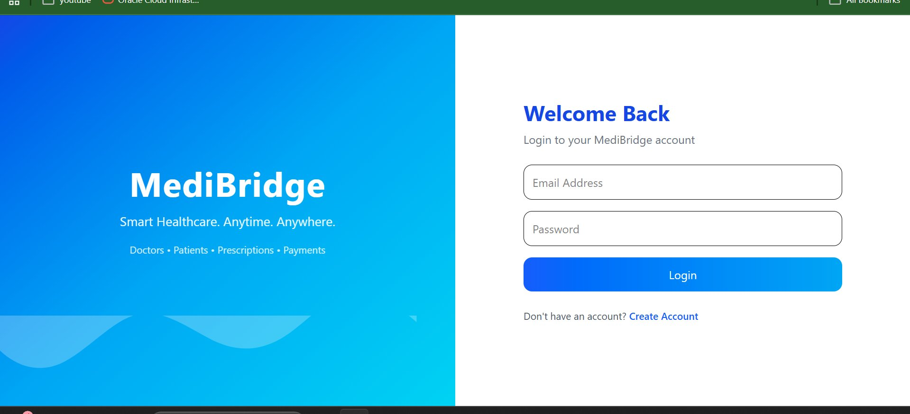
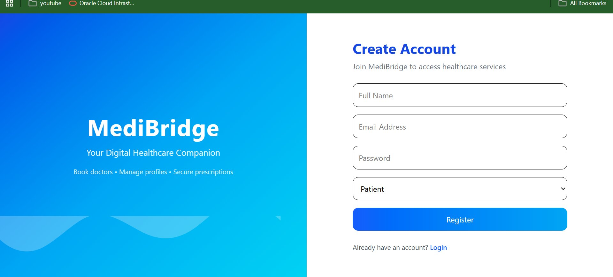
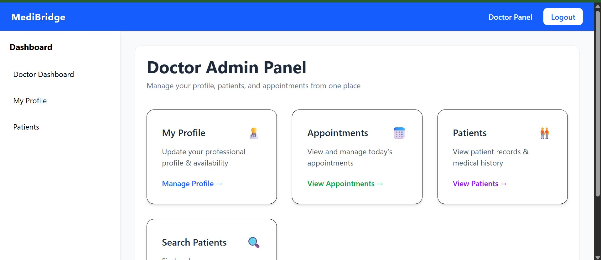
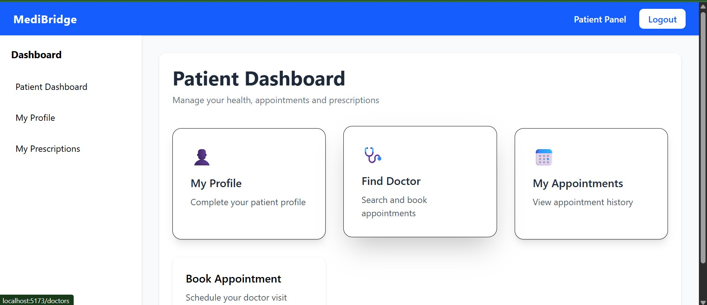

# 🏥 MediBridge — Healthcare Microservices Platform

<div align="center">

**Production-Grade Healthcare Backend · Microservices Architecture**

[](https://spring.io/projects/spring-boot)
[](https://kafka.apache.org)
[](https://mysql.com)
[](https://docker.com)
[](https://aws.amazon.com)

*A production-grade healthcare platform decomposed into 5 independent microservices with event-driven communication via Apache Kafka.*

</div>

---

## 📸 Screenshots

<table>
  <tr>
    <td></td>
    <td></td>
  </tr>
  <tr>
    <td align="center"><b>Login — Smart Healthcare Portal</b></td>
    <td align="center"><b>Register — Role Selection (Doctor/Patient)</b></td>
  </tr>
  <tr>
    <td></td>
    <td></td>
  </tr>
  <tr>
    <td align="center"><b>Doctor Admin Panel</b></td>
    <td align="center"><b>Patient Dashboard</b></td>
  </tr>
</table>

---

## 🏗️ Microservices Architecture

```
React Frontend (Vite)
        │
        ▼  REST API calls (JWT)
┌───────────────────────────────────────┐
│           API Gateway Layer           │
└───────────────────────────────────────┘
        │
   ┌────┴──────────────────────────────────┐
   ▼           ▼           ▼              ▼
auth-service  doctor-    patient-    appointment-
(JWT + RBAC)  service    service       service
                                          │
                                     Kafka Events
                                          │
                                          ▼
                                    payment-service
                                  (async processing)
```

Each service has its **own isolated MySQL database** — no shared DB, no single point of failure.

---

## ✨ Features

- 🔐 **Role-Based Auth** — JWT authentication with separate Doctor and Patient roles
- 👨‍⚕️ **Doctor Panel** — Profile management, appointment scheduling, patient records
- 🧑‍💼 **Patient Dashboard** — Find doctors, book appointments, view prescriptions
- ⚡ **Event-Driven Payments** — Apache Kafka decouples payment from booking — no service blocks another
- 🏥 **5 Independent Services** — Auth, Doctor, Patient, Appointment, Payment
- 🐳 **Docker Ready** — Each service containerized independently
- 🔄 **CI/CD Pipeline** — Jenkins pipeline reduces deployment time by 60%

---

## 🛠️ Tech Stack

| Layer | Technology |
|---|---|
| **Backend** | Java 17, Spring Boot, Spring Security |
| **Auth** | JWT (Stateless), RBAC — Doctor / Patient roles |
| **Messaging** | Apache Kafka (Event-driven payment & booking) |
| **Database** | MySQL — isolated DB per service, JPA/Hibernate |
| **Frontend** | React.js, Vite, Tailwind CSS |
| **DevOps** | Docker, Jenkins CI/CD, AWS EC2 |
| **API** | RESTful APIs, Swagger/OpenAPI |

---

## 📦 Microservices Breakdown

| Service | Port | Responsibility |
|---|---|---|
| `auth-service` | 8081 | JWT login, register, token validation |
| `doctor-service` | 8082 | Doctor profiles, availability, patients |
| `patient-service` | 8083 | Patient profiles, prescriptions |
| `appointment-service` | 8084 | Booking, scheduling, history |
| `payment-service` | 8085 | Async payment via Kafka events |

---

## 📡 Key API Endpoints

| Method | Endpoint | Service | Description |
|---|---|---|---|
| `POST` | `/auth/register` | auth | Register Doctor or Patient |
| `POST` | `/auth/login` | auth | Login, receive JWT |
| `GET` | `/doctors/profile` | doctor | Get doctor profile |
| `GET` | `/doctors/patients` | doctor | View assigned patients |
| `GET` | `/patients/dashboard` | patient | Patient dashboard data |
| `POST` | `/appointments/book` | appointment | Book appointment |
| `GET` | `/appointments/history` | appointment | View appointment history |
| `POST` | `/payments/process` | payment | Process payment (Kafka) |

---

## ⚙️ Local Setup

```bash
git clone https://github.com/Abhishek-fullstack-dev/medibridge-fullstack-microservices.git
cd medibridge-fullstack-microservices
```

### Start each service
```bash
# Auth Service
cd auth-service && ./mvnw spring-boot:run

# Doctor Service
cd doctor-service && ./mvnw spring-boot:run

# Patient Service
cd patient-service && ./mvnw spring-boot:run

# Appointment Service
cd appointment-service && ./mvnw spring-boot:run

# Payment Service
cd payment-service && ./mvnw spring-boot:run

# Frontend
cd frontend && npm install && npm run dev
```

### Prerequisites
- Java 17+
- MySQL running locally
- Apache Kafka running on `localhost:9092`
- Node.js 18+

### Environment Variables (per service)
```env
SPRING_DATASOURCE_URL=jdbc:mysql://localhost:3306/medibridge_auth
SPRING_DATASOURCE_USERNAME=root
SPRING_DATASOURCE_PASSWORD=your_password
JWT_SECRET=your_jwt_secret
KAFKA_BOOTSTRAP_SERVERS=localhost:9092
```

---

## 🚀 Deployment

```bash
# Build Docker image per service
docker build -t medibridge-auth ./auth-service
docker build -t medibridge-doctor ./doctor-service

# Jenkins CI/CD pipeline auto-deploys on push
# Reduced deployment time by 60% vs manual deployment
```

---

## 🔑 Key Engineering Decisions

**Why Microservices?**
Decomposing a healthcare monolith into independent services means a failure in payments doesn't affect appointment booking. Each service scales independently based on load.

**Why Kafka for Payments?**
Payment processing is async — the appointment is confirmed immediately while payment is processed in the background via Kafka events. Zero blocking between services.

**Isolated Databases**
Each microservice owns its database. This enforces loose coupling, prevents accidental cross-service data access, and allows independent schema evolution.

---

## 👤 Author

**Abhishek Kumar** — Java Backend Engineer

[](https://linkedin.com/in/abhishek-kumar-380446233)
[](https://abhishekkumar-dev.vercel.app)
[](https://quizcraft.live)

---

<div align="center"><i>Decomposed from monolith to microservices — built for scale and resilience.</i></div>
